<p align="center">
	
	<br>
	<a href="https://github.com/maciejczyzewski/">@maciejczyzewski</a> + <a href="https://github.com/blazejkrzyzanek/">@blazejkrzyzanek</a>
</p>

## 01/07/2020: sync (past homework)

## 13/06/2020: aia_project

```bash
$ python3 main.py create # create local sqlite3 database
$ python3 main.py runserver --debug
```

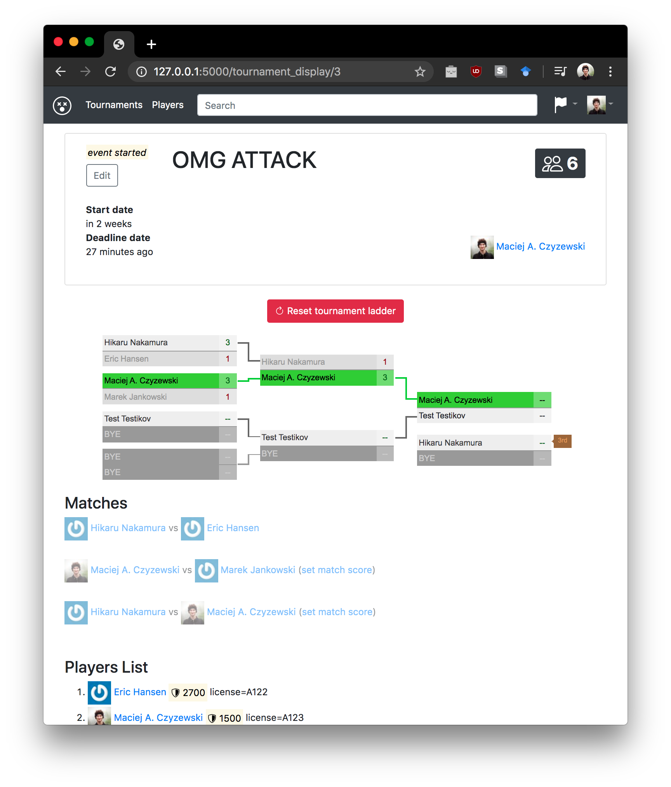

## 20/05/2020: am_task3

## 20/05/2020: am_task2

## 20/05/2020: am_task1

## 16/05/2020: aia_task6

```bash
$ dotnet new webapp --no-https
$ dotnet run
```

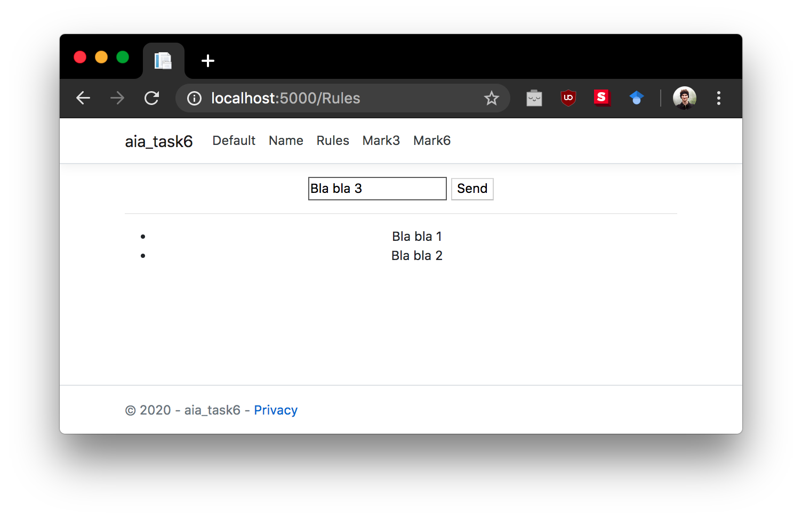

## 06/05/2020: aia_task5

```bash
$ npm install
$ mongod --dbpath=./data   # to run database
$ node ./bin/www           # to run website
```

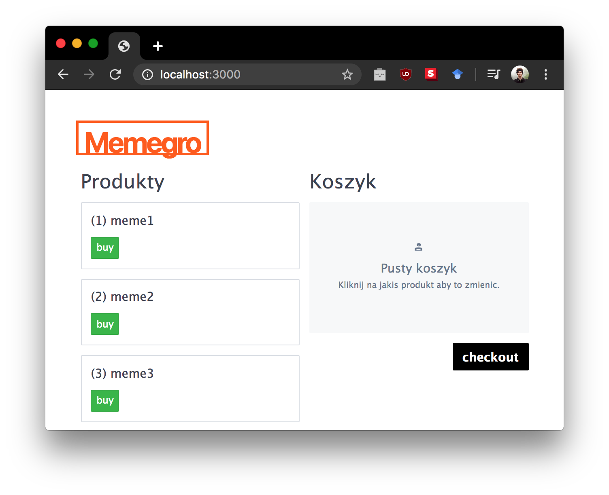
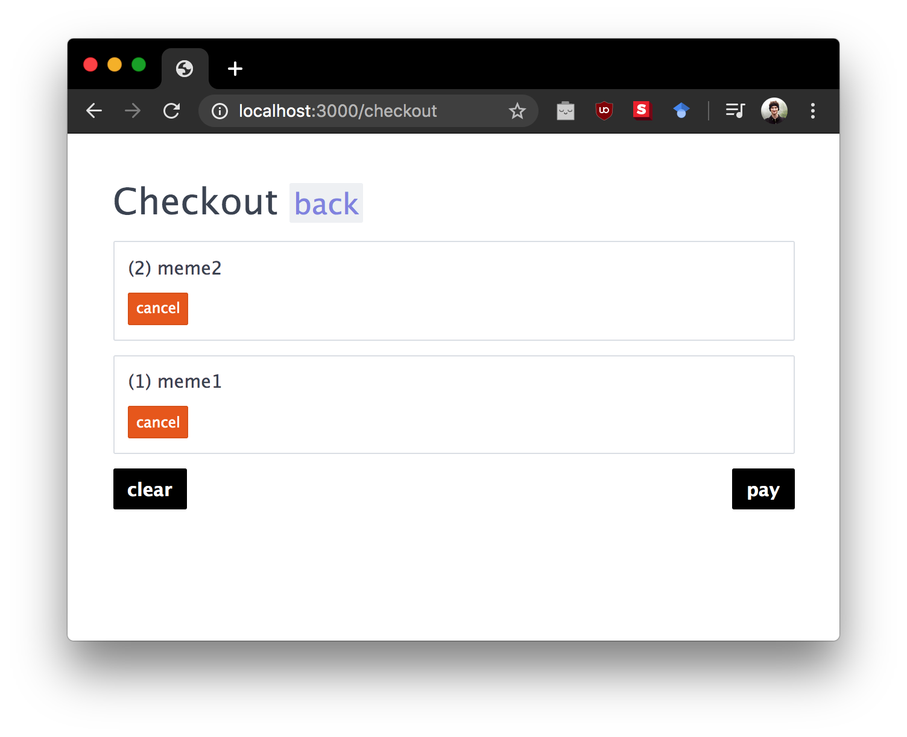

## 13/04/2020: aia_task4

https://maciejczyzewski.github.io/sem6/

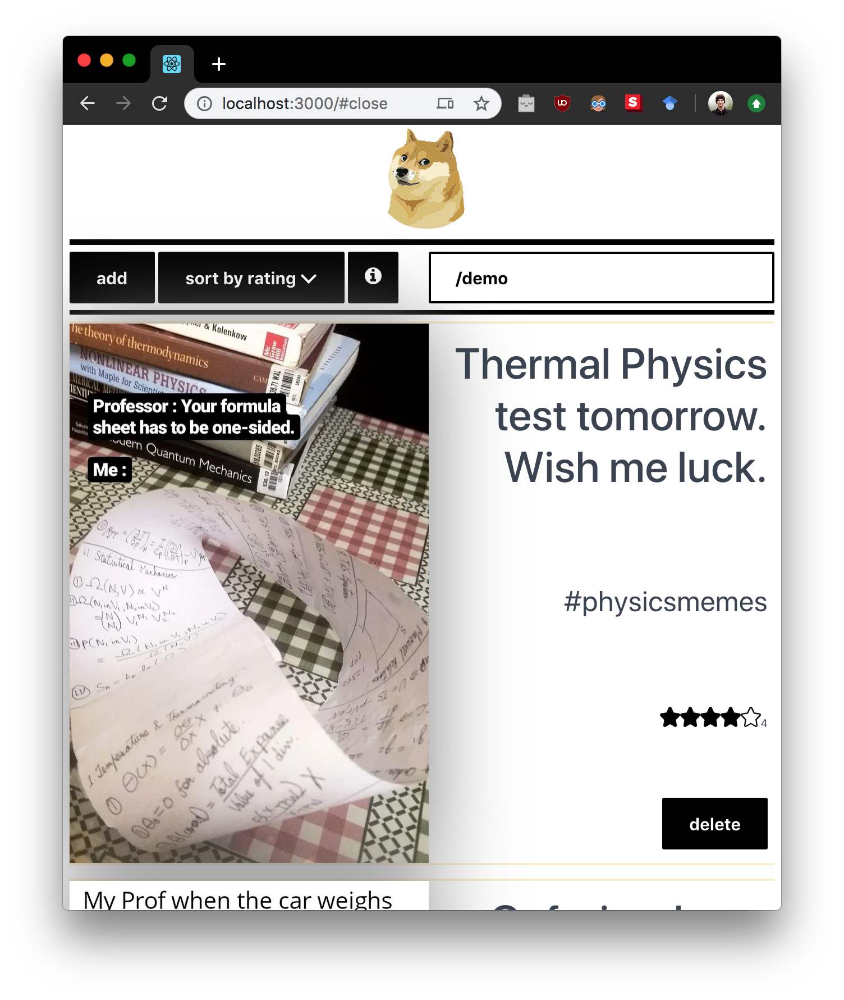
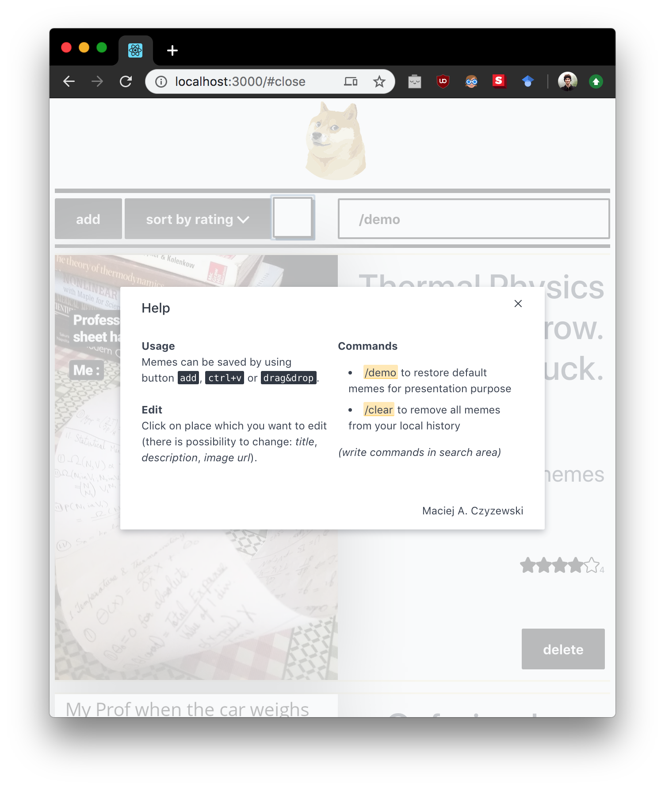
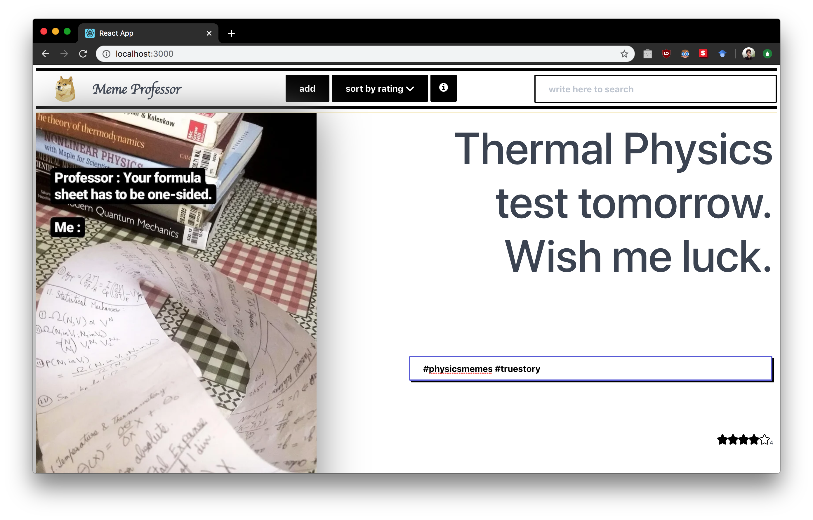

## 07/04/2020: prownolegle_task2

Raport: [**[pdf]**](prownolegle_task2/PR_PROJ1.pdf)

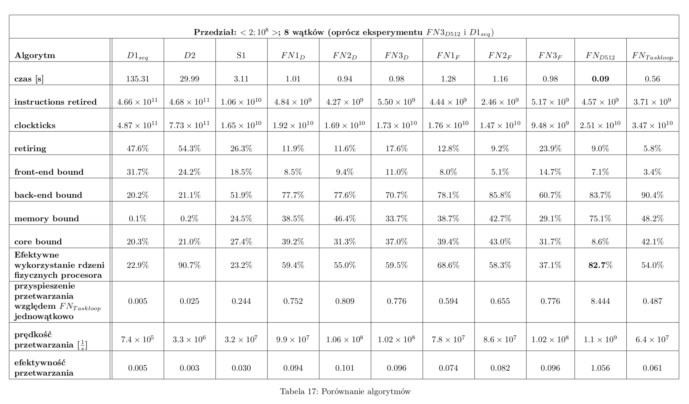
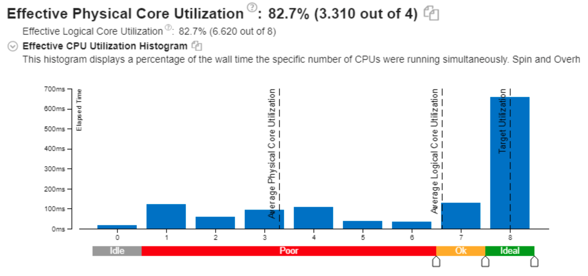

## 04/04/2020: iwm_task2

Raport: [**[pdf]**](https://github.com/maciejczyzewski/sem6/blob/master/iwm_task2/raport/main.pdf)

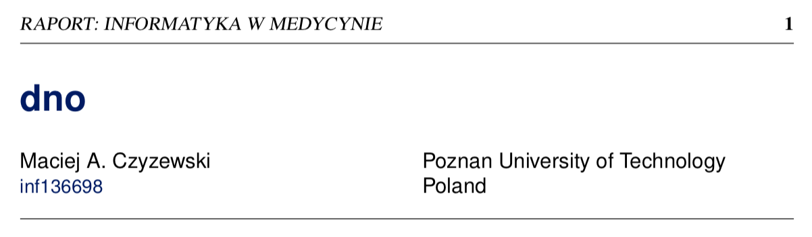
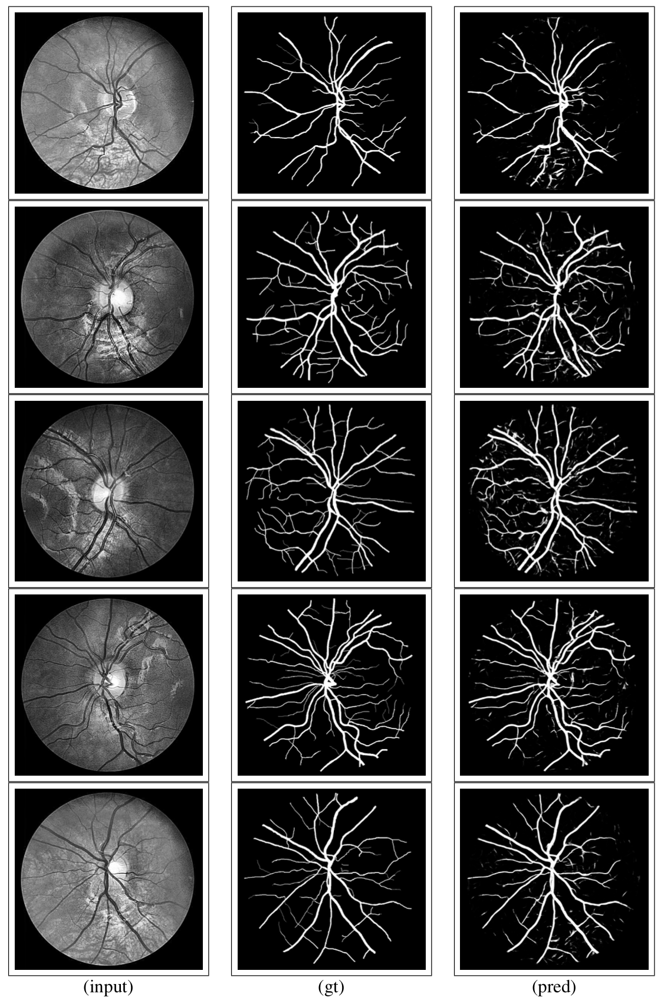

## 01/04/2020: aia_task3

```
aia_task3
├── 15_json.html
├── 16_http.html
├── AJAX.html
├── AJAXEvents.html
├── AJAXSelectors.html
├── AJAXStyles.html
├── Events.html
├── Selectors.html
├── Style.html
└── guitars.json
```

## 27/03/2020: prownolegle_task1

Raport: [**[pdf]**](prownolegle_task1/raport/main.pdf)

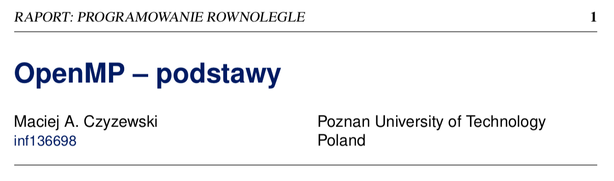

## 25/03/2020: iwm_task1

**Symulator tomografu komputerowego**

Raport: [**[pdf]**](https://github.com/maciejczyzewski/sem6/blob/master/iwm_task1/raport/main.pdf) |
Implementacja: [**[radon.py]**](https://github.com/maciejczyzewski/sem6/blob/master/iwm_task1/radon.py) |
Showcase: [**[jupyter notebook]**](https://github.com/maciejczyzewski/sem6/blob/master/iwm_task1/showcase.ipynb)

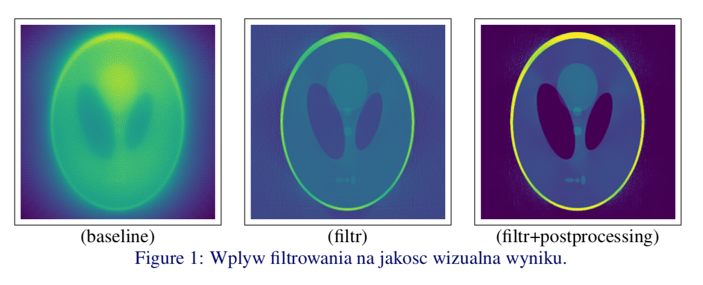

## 20/03/2020: aia_task2

**nani (0.1kB) - toy web framework**

```js
/**
 * @license
 * Nani | Released under MIT license | Copyright Maciej A. Czyzewski
 */
var nani=function(){function t(){
Array.prototype.forEach.call(document.querySelectorAll("[\\@]"),function(t,e){
t.setAttribute("id","i"+e),
Array.prototype.forEach.call(t.querySelectorAll("[\\#]"),function(e,n){
nani.defs["#"][e.getAttribute("#")](t,e)})}),function t(){var t=function(t){
t.target.setAttribute("value",t.target.value)}
;Array.prototype.forEach.call(document.querySelectorAll("input"),function(e,n){
e.addEventListener("input",t,!1)})}()}function e(){
Array.prototype.forEach.call(document.querySelectorAll("[\\!]"),function(t,n){
t.onclick=function(t){var n=function t(e){return function n(t,e){
return null!==t.getAttribute(e)}(e,"@")?e:t(e.parentNode)}(t.target)
;nani.defs["!"][t.target.getAttribute("!")](n,t.target),e()}})}
return Element.prototype.remove=function(){this.parentElement.removeChild(this)
},Element.prototype.set=function(t,e){this.setAttribute("js-"+t,e)},
Element.prototype.get=function(t){return this.getAttribute("js-"+t)},
document.addEventListener("DOMContentLoaded",function(){t(),e()}),{render:t,
defs:{"#":{},"!":{}}}}();
```

---

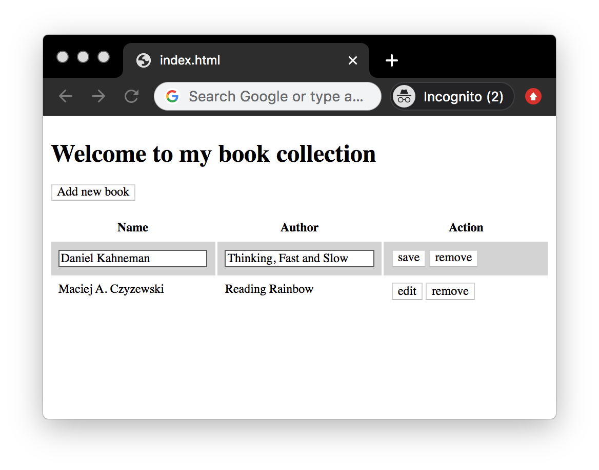

```html
<h1>Welcome to my book collection</h1>
<button @ !=new>Add new book</button>

<ul>
    <li class="header">
        <cell>Name</cell>
        <cell>Author</cell>
        <cell>Action</cell>
    </li>
    <li js-edit=1 @>
        <cell #=data>Daniel Kahneman</cell>
        <cell #=data>Thinking, Fast and Slow</cell>
        <cell #=menu>?</cell>
    </li>
    <li @>
        <cell #=data>Maciej A. Czyzewski</cell>
        <cell #=data>Reading Rainbow</cell>
        <cell #=menu>?</cell>
    </li>
</ul>
```

```js
nani.defs = {
	'#': {
		'data': function(component, el) {
			var input = el.querySelectorAll("input");

			if (component.get('edit') == true) {
				if (input.length == 0) {
					el.innerHTML = `
							<input type="text" value="${el.innerHTML}">
						`;
				}
			} else {
				if (input.length != 0) {
					el.innerHTML = `${input[0].value}`;
				}
			}
		},
		'menu': function(component, el) {
			if (component.get('edit') == true) {
				el.innerHTML = `
						<button !=save>save</button>
						<button !=remove>remove</button>
					`;
			} else {
				el.innerHTML = `
						<button !=edit>edit</button>
						<button !=remove>remove</button>
					`;
			}
		}
	},
	'!': {
		'remove': function(component, el) {
			component.remove();
		},
		'edit': function(component, el) {
			component.set('edit', 1);
			nani.render();
		},
		'save': function(component, el) {
			component.set('edit', 0);
			nani.render();
		},
		'new': function(component, el) {
			var ul = document.querySelectorAll("ul")[0];
			ul.insertAdjacentHTML('beforeend', `
					<li js-edit=1 @>
						<cell #=data>?</cell>
						<cell #=data>?</cell>
						<cell #=menu>?</cell>
					</li>
				`);
			nani.render();
		}
	}
};
```

## 20/03/2020: aia_task1

```bash
$ npm run install
$ node node_modules/node-sass/scripts/install.js
$ webpack --mode development --watch
```

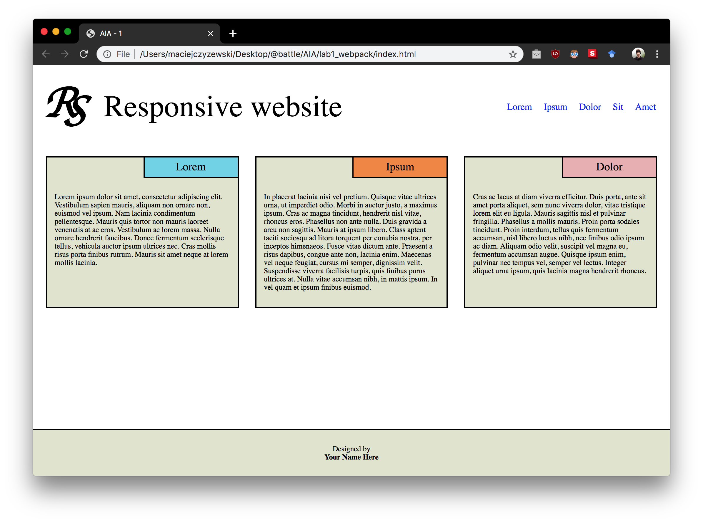
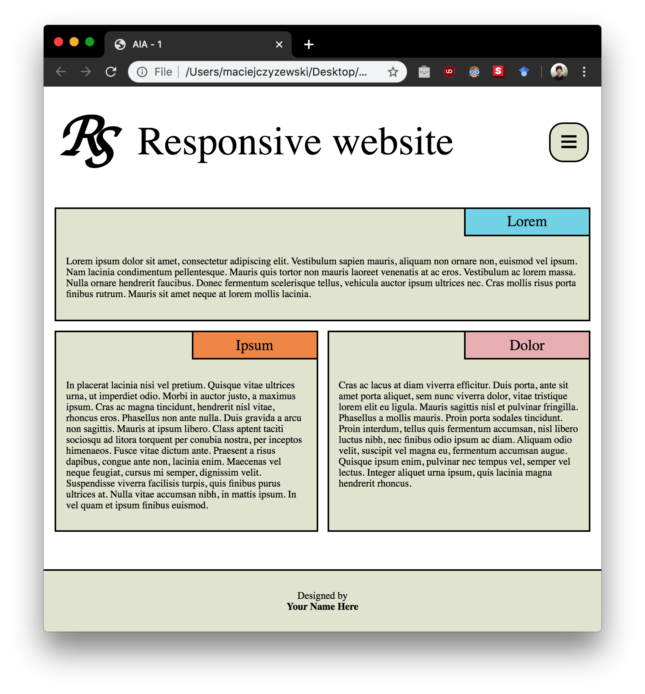
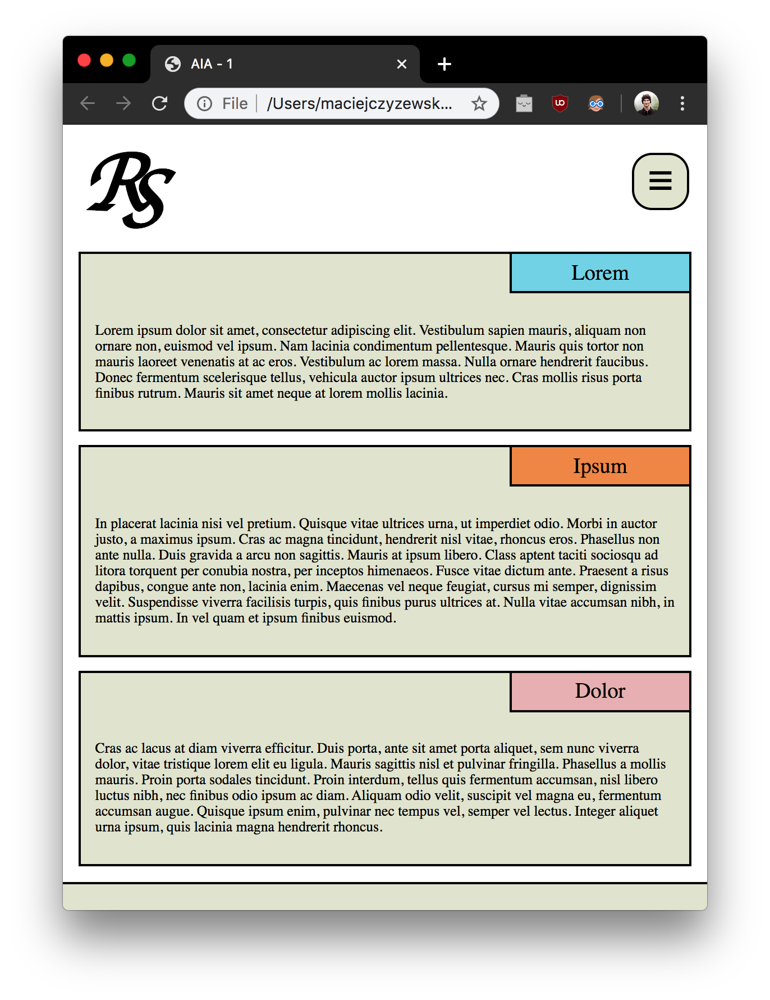
