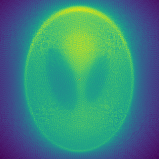

# Symulator tomografu komputerowego

Raport: [**[pdf]**](https://github.com/maciejczyzewski/sem6/blob/master/iwm_task1/raport/main.pdf) |
Implementacja: [**[radon.py]**](https://github.com/maciejczyzewski/sem6/blob/master/iwm_task1/radon.py) |
Showcase: [**[jupyter notebook]**](https://github.com/maciejczyzewski/sem6/blob/master/iwm_task1/showcase.ipynb)

---

**Baseline**

**Filtr**

**Filtr+Postprocessing**

